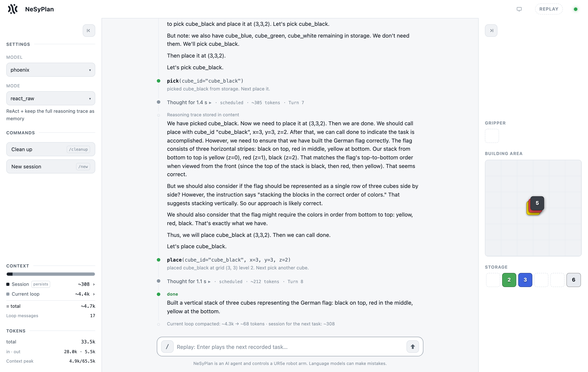
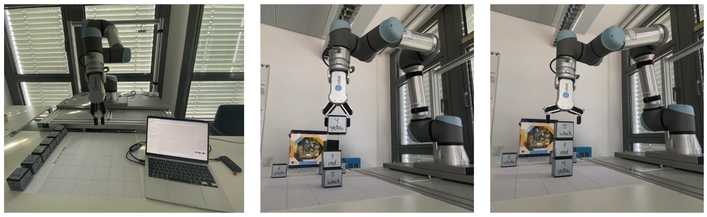

# NeSyPlan Agent

A neuro-symbolic agent for a cube-stacking robot, and a small experiment asking whether
the agentic machinery around an LLM is worth its cost.

An LLM plans. A symbolic executor owns the world and **rejects** any action that violates
it — a cube that is buried, a cell that is occupied, a stack with nothing underneath, a
gripper that cannot fit between two neighbours. The model proposes; the world answers.



*The demonstrator after building the German flag: the reasoning that led to each action on
the left of the transcript, the tool call and the executor's answer beneath it, and the
world — drawn from the same state the model reads — on the right.*

Two things ship in this repository:

- **a browser demonstrator** — type a task in plain language, watch the agent reason, act,
  get refused, and recover, streamed live;
- **a 56-episode experiment** — one-shot planning vs. an agentic loop, with and without
  thinking, scored by code rather than by an LLM.

Everything runs **in one Python process**. No Docker, no simulator, no robot, no
dependencies to install — the world model runs in-process. The only thing you need is an
API key.

---

## Quick start

```bash
git clone <this-repo> && cd nesyplan-agent
cp .env.example .env          # then put your OpenRouter key in it
./scripts/run_web_demo.sh     # opens http://localhost:8600
```

Requirements: **Python 3.9+**. There is no `requirements.txt`: the standard library
covers everything above. The single optional extra is **matplotlib**, imported lazily and
only when the experiment draws a result PNG — without it, runs simply skip the images.
`pip install matplotlib` if you want them.

The key goes in `.env` as `OPENROUTER_API_KEY=...` ([get one
here](https://openrouter.ai/keys)). Everything here — the agent, the eval judge and the
cache summarizer — runs on **`qwen3-32b` over OpenRouter** by default, so one key is the
whole setup. It is a paid model, so the account needs a little credit; without it, requests
fail with HTTP 402 before the model runs.

Then type something into the chat:

> *stack the red, green and blue cube in the middle*
> *build the German flag as a stack*
> *put the yellow cube next to the black one*

### Seeing it without an API key

```bash
./scripts/run_web_demo.sh replay
```

replays a recorded session through the real UI — no key, no model, no cost. One recording
ships with the repository, so this works straight after a clone; once you have run your own
sessions, the newest usable one is replayed instead.

---

## The experiment

**The question.** An agentic loop costs roughly 10× what one planning call costs. When does
it earn that?

**The setup that makes it answerable.** Earlier runs of this system could not answer it,
for an honest reason: the tasks all started from an *empty* building area. With everything
in storage and the goal freely constructible, a blind one-shot plan is nearly sufficient —
and measurably was, matching or beating the agentic loop at a twentieth of the cost. The
world never contradicted the plan, so there was nothing for feedback to catch.

So the experiment runs on **inherited layouts** instead: the world is already in some
configuration when the task begins. A needed cube is buried under another. A cube is boxed
in on both grasp axes and is literally unreachable until a neighbour moves. The goal cells
are occupied by the wrong cubes. Nothing is hidden — both modes see the full layout — but
a correct plan now requires simulating *intermediate* states: after I lift this, what is
reachable, what did I just block, where do I put the thing I took off?

**The matrix.** 4 tasks × 7 configurations × 2 repetitions = 56 episodes.

|  | no thinking | thinking |
| --- | --- | --- |
| **plan once** | `oneshot_nocot` | `oneshot` |
| **act turn by turn** | `act` | `react` |

plus three memory arms:

- `react_raw` — the **verbatim** reasoning trace carried in `content` between turns
- `react_summary` — a **distilled note** instead of the verbatim trace
- `on_error_summary` — that note, but thinking **only after a rejection** (the cheap arm)

Those three exist because of a detail that decides a lot: **a reasoning trace is not
carried into the next request.** Unless the model writes its conclusion into `content`
itself — which ~30B models routinely do not, measured at 0% here — it is gone by the next
turn. `RAW` and `SUMMARY` supply that memory externally, and differ only in whether the
trace is compressed first. Keeping both is what separates *"the memory mechanism does not
work"* from *"the compression loses something"*.

**The scoring.** Every task in this tier has a **symbolic checker** that reads the final
world state. That matters: an LLM judge on this domain flips its verdict on identical
structures and invents cube colours the scene never had (see
[docs/FINDINGS.md](docs/FINDINGS.md)). The judge still runs alongside, and its agreement
with the checker is recorded — so its unreliability stays measurable instead of assumed.

```bash
./scripts/run_experiment.sh --list     # print the matrix, run nothing
./scripts/run_experiment.sh            # ~56 episodes
```

Results land in `results/harness/` (`summary.md`, `results.jsonl`, `report.html`, and a
full transcript per run). The campaign is resumable — re-run it and finished cells are
skipped.

The short version of what came back, on `qwen3-32b`:

| config | solved | tokens | tokens per success |
| --- | --- | --- | --- |
| `oneshot` — plan once, blind | 1/8 | 3 788 | 30 306 |
| `act` — feedback, no thinking | **0/8** | 39 936 | — |
| `react` — feedback **and** thinking | **6/8** | 38 620 | **51 494** |
| `react_summary` — + a distilled note | 6/8 | 78 811 | 105 082 |
| `react_raw` — + the verbatim trace | 3/8 | 200 516 | 534 709 |

The loop earns its cost, but only together with deliberation: `act` reads every refusal,
never stops to think, and solves nothing at the same token price as `react`.

The memory arms are the honest negative result. Both engage — carrying something forward
cuts the average reasoning trace by 2.1–2.7×, exactly the mechanism working — and neither
converts that into a task solved. `react_raw` carries 14× the payload per turn and
compounds it, which is how a single episode reaches 320 k tokens. **Plain ReAct, carrying no
memory at all, is the best arm on this model.**

That is the opposite of what the same code found on a different model, which is the point:
a mode's ranking is not a property of the mode.

**The full table, the per-task matrix and how to read them:
[docs/EXPERIMENT.md](docs/EXPERIMENT.md).**

---

## How it works

```
   LLM  ──pick/place/store/done──►  Executor        the model proposes
        ◄──ok, or REJECTED + why──  (owns the world)  the world answers
                  ▲
          Orchestrator: may the model think this turn?
                        what carries over to the next one?
```

Two dimensions, both plain configuration of one loop:

- **invocation policy** — `oneshot` · `always` · `reason_first` · `periodic(N)` ·
  `self_triggered` (the model asks, via a `think()` tool) · `on_error`
- **reasoning cache** — `none` · `raw` · `summary`

The UI makes the first one visible: every reasoning block is labelled with *why* the loop
decided to think on that turn — first turn, after failure, self-requested, before
`done()`.

Full tour in **[docs/ARCHITECTURE.md](docs/ARCHITECTURE.md)**.

---

## Other entry points

```bash
python3 -m nesyplan.demo                      # the same engine, in the terminal
python3 -m nesyplan.run "build a pyramid"     # one scripted episode
python3 -m nesyplan.eval --list               # the full task/config matrix
python3 -m nesyplan.probe_reasoning --models qwen3-32b   # can this model stop thinking?
```

### Models

Short aliases resolve to full ids, and the *model* decides which endpoint is used
([`model_aliases.py`](nesyplan/model_aliases.py)). `qwen3-14b`, `qwen3-30b-a3b` and
`qwen3-32b` are verified working over OpenRouter, including tool calls and a genuine
reasoning off-switch. The `phoenix` / `kimi` / `command` / `merlin` aliases point at Aleph
Alpha's internal endpoint and are not reachable without access to it.

```bash
./scripts/run_web_demo.sh --model qwen3-14b
```

Any OpenAI-compatible endpoint works — set `PHOENIX_BASE_URL` and pass `--model` with its
model id.

### Driving a real robot



*The cell this world model was extracted from: the operator's view with the laptop running
this demonstrator, a place in progress, and a finished three-cube tower.*

The world model was extracted from a containerised executor driving a UR5e arm with an
OnRobot RG2 gripper. That executor is not part of this repository, but the agent can still
drive it — the HTTP contract is in [docs/ARCHITECTURE.md](docs/ARCHITECTURE.md):

```bash
./scripts/run_web_demo.sh --backend sim --url http://localhost:8100
```

The printed plate is [`images/plate-template-a2.pdf`](images/plate-template-a2.pdf) — the
6×6 building area and the storage row, at A2. The cell pitch is one configuration value;
the agent only ever sees a 0–6 grid, so re-printing at a different size changes nothing it
reads.

---

## Repository layout

```
nesyplan/          the agent: loop, policies, cache, world model, eval, web UI
  webui/           the browser front end (Vue, vendored; no build step)
data/cubes.json    the cube set — one source of truth for state, prompt and drawing
scripts/           run_web_demo.sh · run_experiment.sh
docs/              ARCHITECTURE.md · EXPERIMENT.md · FINDINGS.md
images/            UI screenshots, photographs of the cell, the printable plate
results/harness/   the shipped campaign's summary, results table and manifest
llm_logs/          your recorded sessions (plus the one shipped for `replay`)
```

## Status and licence

Research code, published as a demonstrator rather than a library — the interfaces are not
stable and there are no unit tests.

Licensed under the **[Apache License 2.0](LICENSE)**.

The vendored `nesyplan/webui/vendor/vue.global.prod.js` is [Vue 3](https://vuejs.org),
MIT-licensed, and belongs to its authors.
