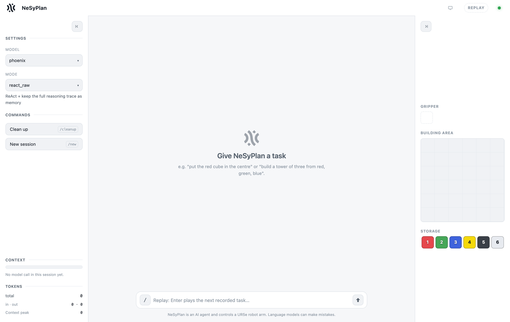

# Architecture

How the pieces fit, and why the interesting ones are shaped the way they are.

## The loop

```
        ┌──────────────┐   pick / place / store / done   ┌──────────────────┐
        │              │ ──────────────────────────────► │                  │
        │   LLM        │                                 │  Executor        │
        │  (neural)    │ ◄────────────────────────────── │  (symbolic)      │
        │              │   ok + new state, or REJECTED    │                  │
        └──────────────┘   + the reason why               └──────────────────┘
               ▲                                                   │
               │                                          owns the world state
               │                                          validates every action
        ┌──────┴───────┐
        │ Orchestrator │  decides: may the model think this turn?
        │              │  decides: what is carried into the next turn?
        └──────────────┘
```

The model never changes the world. It *proposes* an action; the executor checks that
action against the actual state and either applies it or refuses it with a reason. That
refusal is the entire feedback channel — and the thing the experiment measures the value
of.

What the executor checks before it accepts a `place`:

- **bounds** — the cube centre must stay inside the 6×6 building area, margin included
- **occupancy** — is something already there?
- **support** — a cube at level 2 needs a cube at level 1 beneath it
- **reachability** — is the cube buried under another one? Can the gripper's jaw axis
  actually get in, given the neighbours?

Each failure produces a different sentence, and how much of that sentence the model gets
to read is itself a configurable lever (`terse` / `why` / `fix`, see
[`nesyplan/environment.py`](../nesyplan/environment.py)).

## The two dimensions

Everything the study varies is configuration of one loop
([`nesyplan/config.py`](../nesyplan/config.py)):

**Dimension 1 — invocation policy: when may the model think?**
`ONESHOT` (plan once, then execute blind) · `ALWAYS` (think every turn) ·
`REASON_FIRST` · `PERIODIC(N)` · `SELF_TRIGGERED` (the model asks, via a `think()` tool) ·
`ON_ERROR` (think only after a rejection).

**Dimension 2 — reasoning cache: what survives to the next turn?**
`NONE` · `RAW` (the trace verbatim) · `SUMMARY` (a distilled note).

Dimension 2 exists because of a detail that is easy to miss: **a reasoning trace is not
carried into the next request.** The provider returns it, the harness logs it, and then it
is gone. Anything the model worked out lives on only if the model wrote it into `content`
itself — and the ~30B models this repository targets frequently write nothing there at
all. `SUMMARY` supplies that memory externally. Whether it pays for itself is the question
[docs/EXPERIMENT.md](EXPERIMENT.md) answers.

## Where the world lives

Two interchangeable backends behind one method surface (`health` / `get_state` /
`send_command`):

| | `--backend fake` (default) | `--backend sim` |
| --- | --- | --- |
| implementation | [`nesyplan/fake_robot.py`](../nesyplan/fake_robot.py) | [`nesyplan/robot_client.py`](../nesyplan/robot_client.py) |
| world state | in this process | in an external server, over HTTP |
| motion | none | a simulated or real arm moves |
| reset | instant | `store()` every cube back |
| needs | nothing | that server |

The orchestrator cannot tell which one it is talking to. That symmetry is deliberate: it
is what lets the experiment run anywhere while the same agent code drives real hardware
unchanged.

### On the external executor

This repository ships the **agent** and the **world model**, not a robot stack. The
`--backend sim` path exists because the world model was extracted from a containerised
executor driving a UR5e arm with an OnRobot RG2 gripper, in simulation and on real
hardware. There, the same validation runs in pure Python, and only the `pick()`/`place()`
*motion* touches the simulator.

That executor is not included — it ships as pre-built images belonging to a third party.
If you have one, it needs to speak:

```
GET  /state              -> {ok, grid_units, held, cubes:{id:{color,number,location,x,y,level}}, mode:"tracked"}
GET  /health             -> {ok, status}
POST /command {action…}  -> {ok, message|error, observation}
     actions: pick(cube_id) · place(cube_id,x,y,z) · store(cube_id) · done(reason)
```

Everything above that boundary — the loop, the policies, the cache, the UI, the eval — is
in this repository and unaffected by which side of it you run.

**One consequence worth stating:** the in-process model reproduces the *symbolic*
failures, not physical ones. Nothing here can drop a cube or miss an IK solution. For the
orchestration question that is not a limitation — the failures that make an agentic loop
worth having are symbolic — but a green run here is not a statement about motion.

### Limits that matter before you point this at an arm

Three boundaries are properties of the design, not bugs awaiting a fix. Each one is safe in
this workspace for a specific reason, and each stops being safe if you change that reason.

**1. No perception.** The world model is seeded once from the scene definition and is never
corrected by sensing. Every check the validators run traces back to that file rather than
to the table. This is what makes the validation exact — and it means the system cannot
distinguish a correct world from a confidently wrong one. If the physical cubes do not
stand where the scene says they stand, every check still passes and every refusal is still
well argued, about a layout that no longer exists. The same gap swallows failures *during* a
run: if a grasp slips, or someone nudges a cube between two turns, nothing notices.
**Confirming the physical layout before starting a run is not a formality; it is the only
check that exists.**

**2. No path avoidance.** The planner moves in straight lines and will not route around an
obstacle. Safety rests entirely on the gantry path: rise, travel above the tallest cube the
world model knows about, descend into a column known to be clear. That makes collisions
unrepresentable *here*, where the only obstacles are cubes the model already tracks and the
plate is flat. It does not generalise. Put a fixture, a second arm, or anything else the
world model does not know about into the cell and the guarantee lapses, because the
clearance height is computed from the model rather than observed.

**3. No force or compliance control.** Grasping is open-loop: the gripper is commanded to a
width with a set force and reports nothing useful about what it actually holds. Nothing
reacts to contact, so whatever the arm meets on the way down is met at the commanded speed.
For six identical light cubes on a flat plate that is an acceptable trade — and one of the
reasons the task was kept this simple.

## The modules

| | |
| --- | --- |
| `orchestrator.py` | the loop itself: `AgenticSession` (turn by turn) and `_oneshot_core` (plan once) |
| `policy.py` | should the model reason on this turn? |
| `cache.py` | what gets written into `content` between turns |
| `prompts.py` · `tools.py` | one source of truth for the system prompt and tool schemas |
| `environment.py` | the domain: grid, state rendering, feedback levels |
| `fake_robot.py` | the symbolic executor (the world model) |
| `scenarios.py` | named starting layouts — a cube buried, boxed in, goal cells occupied |
| `tasks.py` · `checkers.py` | the task ladder and their symbolic scorers |
| `eval.py` · `aggregate.py` · `viewer.py` | campaign runner, roll-up, HTML report |
| `judge.py` | the LLM fallback scorer (secondary — see FINDINGS) |
| `llm.py` · `providers.py` · `model_aliases.py` | one OpenAI-compatible client, routed per model |
| `web_demo.py` · `webui/` | the browser demonstrator (SSE, Vue, no build step) |
| `demo.py` · `run.py` | the same engine in a terminal, and a single scripted episode |

Standard library only, with one optional exception: `render.py` imports **matplotlib**
lazily, and only to draw a result PNG. Nothing else needs it, and `eval.py` simply skips
the images if it is not installed.

## The web UI



*Three columns. Left: model, mode, a deterministic clean-up button, and the two live meters
(context split into what persists across tasks versus the current loop, and tokens). Middle:
the conversation. Right: the gripper, the 6×6 building area and the storage row.*

`web_demo.py` serves a single page and streams the run over Server-Sent Events. What the
browser shows is not a rendering of a simulator — it draws the world from the same
symbolic state the model reads, so the picture and the prompt can never disagree. That makes
the panel a debugging tool as well: if it and the agent's account of what it built disagree,
the model has lost track and the symbolic layer has not.

The stream is the point: every reasoning block, every tool call, every rejection, and the
reason the loop decided to think on that turn (`first turn`, `after failure`,
`self-requested`, `before done()`). That last one makes the invocation policy visible
rather than theoretical.

`--backend replay` plays a recorded transcript back through the same UI, with no LLM and
no key — useful for showing the system offline.
